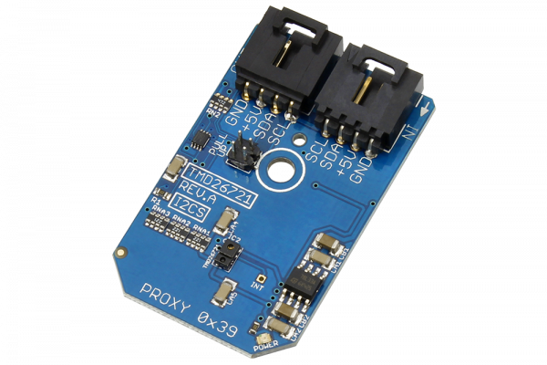

# TMD26721

The TMD26721is an infrared digital proximity detector.This device includes improved features, such as signal-to-noise frequency and accuracy. To prevent false proximity data measurement, the TMD26721 proximity saturation indicator bit signals that the internal analog circuitry has reached saturation.
This Device is available from www.ncd.io 

[SKU: TMD26721_I2CS]

(https://store.ncd.io/product/tmd2671-infrared-digital-proximity-detector-i2c-mini-module/)
This Sample code can be used with Arduino.

Hardware needed to interface TMD26721 sensor with Arduino

1. <a href="https://store.ncd.io/product/i2c-shield-for-arduino-nano/">Arduino Nano</a>

2. <a href="https://store.ncd.io/product/i2c-shield-for-arduino-micro-with-i2c-expansion-port/">Arduino Micro</a>

3. <a href="https://store.ncd.io/product/i2c-shield-for-arduino-uno/">Arduino uno</a>

4. <a href="https://store.ncd.io/product/dual-i2c-shield-for-arduino-due-with-modular-communications-interface/">Arduino Due</a>

5. <a href="https://store.ncd.io/product/tmd2671-infrared-digital-proximity-detector-i2c-mini-module/">TMD26721 Infrared Digital Proximity Detector Sensor</a>

6. <a href="https://store.ncd.io/product/i%C2%B2c-cable/">I2C Cable</a>

TMD26721:

The TMD26721is an infrared digital proximity detector.This device includes improved features, such as signal-to-noise frequency and accuracy. To prevent false proximity data measurement, the TMD26721 proximity saturation indicator bit signals that the internal analog circuitry has reached saturation.

Applications:

• Mobile Handset Touchscreen Control and Automatic Speakerphone Enable

• Mechanical Switch Replacement

• Paper Alignment

• Digital Signage

How to Use the TMD26721 Arduino Library

The TMD26721 has a number of settings, which can be configured based on user requirements.
   
1.Proximity Interrupt time:The following command is used to set the Proximity Interrupt time.
 
            tmd.setPTime(PTIME_2_73MS);               // Cycles: 1, Time: 2.73 ms Max Count: 1023
            
2.Wait time:The following command is used to set the wait time for sensor.

             tmd.setWTime(WTIME_1);                  // Wait Time: 1, Time (WLONG = 0): 2.72 ms Time (WLONG = 1):  0.032 sec
           
3.Proximity drive:The following command is used to set the proximity drive.

            tmd.setProximityDrive(PDRIVE_100);        // LED Strength – PDL=0: 100mA, LED Strength – PDL=1: 11.1mA
           
4.Proximity diode selection:The following command is used for the selection of diode.             
           
           tmd.setProximityDiode(PDIODE_CH1);        // Proximity Uses the CH1 Diode
             
5.Proximity gain setting:The following command is used to set the proximity gain of sensor.

            tmd.setProximityGain(PGAIN_1X);           // Proximity Gain: 1X
